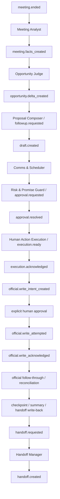

# Helm v2 Event Flow + API Contract v1

## Purpose

This document expands the Helm v2 foundation into:

- event flow
- worker handoff flow
- planned API contracts

It is a contract package with some current-main runtime reality already landed.
These are planned contracts only.

Current main already implements the narrow runtime around:

- `meeting-ended.ingest`
- `meeting-facts.confirm`
- review / approval surfaces inside the meeting detail
- human-action execution sync / acknowledgement inside the meeting detail
- official-write intent sync / review / attempt / acknowledgement inside the meeting detail
- limited-auto eligibility / review / constrained execution / acknowledgement inside the meeting detail
- official follow-through sync / update / resolution handling inside the meeting detail
- connector-ingestion sync / retrieval trace inside the meeting detail

Everything else in this document should still be read as contract direction, not a claim that the whole operating runtime is complete.

## Primary event catalog

- `meeting.ended`
- `meeting.facts_created`
- `opportunity.delta_created`
- `proposal.requested`
- `followup.requested`
- `draft.created`
- `approval.requested`
- `approval.resolved`
- `execution.ready`
- `execution.acknowledged`
- `official.write_intent_created`
- `official.write_limited_auto_synced`
- `official.write_limited_auto_attempted`
- `official.write_limited_auto_acknowledged`
- `official.write_attempted`
- `official.write_acknowledged`
- `official.write_followthrough_synced`
- `official.write_followthrough_updated`
- `handoff.requested`
- `handoff.created`

## Primary flow



Current main also has an optional Sprint 8-9 branch between explicit human approval and `official.write_attempted`:

- only for a tiny whitelist
- only after explicit approval
- only when strong acknowledgment is supported
- always with force-manual override
- never as broad auto-write
- current executable whitelist stays narrow: `crm.attach_note` and `crm.update_next_action`

## Worker outputs by stage

### Meeting Analyst

Outputs:

- `meeting_facts.json`
- `risk_flags.json`
- `action_pack.md`

### Opportunity Judge

Outputs:

- `opportunity_delta.json`
- `next_step_brief.md`
- `manager_attention_flags.json`

### Proposal Composer

Outputs:

- `customer_followup_draft.md`
- `internal_collab_brief.md`
- `exec_brief.md`

### Comms & Scheduler

Outputs:

- `email_draft.eml`
- `calendar_options.json`
- `message_variants.md`

### Risk & Promise Guard

Outputs:

- `risk_review.json`
- `approval_requirements.json`
- `sanitized_artifact.md`

### Human Action Execution

Outputs:

- `human_action_execution_bundle.json`
- execution acknowledgement payload
- checkpoint / summary write-back

### Official System Integration Guarded Path

Outputs:

- `official_write_intent.json`
- acknowledgment payload
- reconciliation note

### Official Coverage Follow-through

Outputs:

- `official_followthrough.json`
- follow-through summary
- reconciliation / resolution note
- write-back target list

### Connector ingestion + retrieval policy

Outputs:

- `connector_ingestion_contract.json`
- `retrieval_trace.json`
- loading rationale / skipped refs explanation

### Handoff Manager

Outputs:

- `handoff_pack.md`
- `delivery_risk_checklist.json`
- `first_14_day_plan.md`

## Planned event envelope

```json
{
  "event_id": "evt_meeting.ended_ws_123",
  "type": "meeting.ended",
  "workspace_id": "ws_123",
  "object_refs": {
    "workspace_id": "ws_123",
    "customer_id": "cust_456",
    "opportunity_id": "opp_789",
    "meeting_id": "mtg_001"
  },
  "triggered_by": "human",
  "created_at": "2026-04-02T10:00:00Z",
  "payload": {}
}
```

## Planned API contracts

These contracts mix:

- current-main implemented routes
- current-main implemented surface-backed actions
- planned next-layer APIs

### 1. `meeting-ended.ingest`

- Method: `POST`
- Suggested path: `/api/runtime/events/meeting-ended`
- Purpose: ingest meeting-end event and start Meeting Analyst
- Request:
  - `workspaceId`
  - `meetingId`
  - `transcriptRef`
  - `calendarContext`
  - `objectRefs`
- Response:
  - accepted event envelope
  - execution bundle id
- Tier: `A0`

### 2. `meeting-facts.confirm`

- Method: `POST`
- Suggested path: `/api/runtime/memory/meeting-facts/confirm`
- Purpose: confirm structured meeting facts before promotion/writeback
- Request:
  - `meetingId`
  - `artifactBundleId`
  - `confirmationEdits`
  - `reviewer`
- Response:
  - confirmed memory refs
  - next event ids
- Tier: `A1`

### 3. `opportunity-shadow.update`

- Method: `POST`
- Suggested path: `/api/runtime/opportunities/shadow-update`
- Purpose: write shadow stage / blocker / next-step delta
- Request:
  - `opportunityId`
  - `meetingFactsRef`
  - `timelineRefs`
  - `deltaProposal`
- Response:
  - accepted shadow delta
  - artifact refs
- Tier: `A1`

### 4. `artifact-review.request`

- Method: `POST`
- Suggested path: `/api/runtime/approvals/artifact-review`
- Purpose: run risk/promise guard and create approval posture
- Request:
  - `artifactRefs`
  - `actionKey`
  - `policyScope`
  - `sourceProvenance`
- Response:
  - `risk_review.json`
  - `approval_requirements.json`
  - `sanitized_artifact.md`
- Tier: `A2`

### 5. `handoff-pack.request`

- Method: `POST`
- Suggested path: `/api/runtime/handoffs/request`
- Purpose: generate handoff pack and checkpoint memory
- Request:
  - `opportunityId`
  - `promisedScopeRefs`
  - `riskHistoryRefs`
  - `targetRole`
- Response:
  - handoff pack refs
  - checkpoint memory refs
- Tier: `A2`

### 6. `human-action-execution.sync`

- Method: `POST`
- Suggested path: `/api/runtime/execution/sync`
- Purpose: turn approved drafts or approved shadow recommendations into manual execution actions
- Request:
  - `meetingId`
  - `approvedArtifactRefs`
  - `approvalContext`
- Response:
  - ready execution actions
  - boundary notes
  - write-back targets
- Tier: `A2`

### 7. `human-action-execution.acknowledge`

- Method: `POST`
- Suggested path: `/api/runtime/execution/acknowledge`
- Purpose: record that a human completed, blocked, or deferred a manual step
- Request:
  - `meetingId`
  - `executionId`
  - `ackMode`
  - `proofPayload`
- Response:
  - audit acknowledgement
  - checkpoint memory refs
  - object summary write-back refs
- Tier: `A2`

### 8. `official-write.intent.sync`

- Method: `POST`
- Suggested path: `/api/runtime/official-write/sync`
- Purpose: derive guarded official write intents from approved shadow recommendations or approved execution proof
- Request:
  - `meetingId`
  - `approvedShadowRef`
  - `approvedExecutionProofRefs`
- Response:
  - guarded write intents
  - source eligibility summary
- Tier: `A3`

### 9. `official-write.intent.review`

- Method: `POST`
- Suggested path: `/api/runtime/official-write/review`
- Purpose: explicitly approve, reject, block, or keep pending a guarded official write intent
- Request:
  - `meetingId`
  - `officialWriteIntentId`
  - `reviewMode`
  - `reviewNotes`
- Response:
  - updated approval posture
  - boundary state
- Tier: `A3 / A4`

### 10. `official-write.intent.acknowledge`

- Method: `POST`
- Suggested path: `/api/runtime/official-write/acknowledge`
- Purpose: record write attempt success / failure / deferred retry / reconciliation note after a guarded official write attempt
- Request:
  - `meetingId`
  - `officialWriteIntentId`
  - `acknowledgementMode`
  - `externalSystemReference`
  - `note`
- Response:
  - acknowledgment result
  - audit / checkpoint / summary write-back refs
- Tier: `A3 / A4`

### 10A. `official-write.followthrough.sync`

- Method: `POST`
- Suggested path: `/api/runtime/official-write/followthrough/sync`
- Purpose: derive official follow-through items from acknowledged guarded writes or manual override outcomes
- Request:
  - `meetingId`
  - `officialWriteIntentId`
  - `limitedAutoIntentId`
- Response:
  - official follow-through items
  - follow-through summary
- Tier: `A3 / A4`

### 10B. `official-write.followthrough.update`

- Method: `POST`
- Suggested path: `/api/runtime/official-write/followthrough/update`
- Purpose: record assignment, escalation, reconciliation note, defer, close, or resolution after an official outcome
- Request:
  - `meetingId`
  - `officialFollowThroughId`
  - `updateMode`
  - `note`
- Response:
  - updated follow-through state
  - audit / summary / handoff write-back refs
- Tier: `A3 / A4`

### 11. `connector-ingestion.sync`

- Method: `POST`
- Suggested path: `/api/runtime/connector-ingestion/sync`
- Purpose: normalize richer connector sources into explicit trust / promotion / evidence posture before worker retrieval
- Request:
  - `meetingId`
  - `runtimeEventId`
  - `sourceRefs`
  - `objectRefs`
- Response:
  - normalized connector ingestion records
  - trust / promotion summary
- Tier: `A0 / A1`

### 12. `retrieval-trace.explain`

- Method: `POST`
- Suggested path: `/api/runtime/retrieval/explain`
- Purpose: resolve retrieval policy, record what was loaded, and explain what stayed on-demand or stale-suppressed
- Request:
  - `meetingId`
  - `runtimeLabel`
  - `eventType`
  - `namespace`
- Response:
  - retrieval traces
  - loading rationale
  - skipped refs and stale suppression
- Tier: `A0 / A1`

## Approval posture in the event flow

- `meeting.parse` -> `A0`
- `memory.write_draft` -> `A1`
- `opportunity.shadow_update` -> `A1`
- `email.create_draft` -> `A2`
- `calendar.create_draft` -> `A2`
- `human_action_execution.sync` -> `A2`
- `human_action_execution.acknowledge` -> `A2`
- `crm.update_official_stage` -> `A4`
- `crm.update_next_action` -> `A3`
- `crm.update_blockers` -> `A3`
- `crm.attach_note` -> `A3`
- `crm.attach_handoff_summary` -> `A4`
- `email.send_external` -> `A3`
- `quote.create` -> `A3`, may escalate to `A4`
- `approval.submit` -> `A3`
- `contract.modify` -> `A4`
- `customer_commit_delivery_date` -> `A4`

## Preserved boundaries

This contract package still preserves:

- no default send authority
- no automatic external execution
- no default automatic official CRM writeback
- no automatic email send or calendar booking
- no automatic execution acknowledgement
- no all-history context stuffing
- no workflow-control platform claim
- no broad agent-team default
